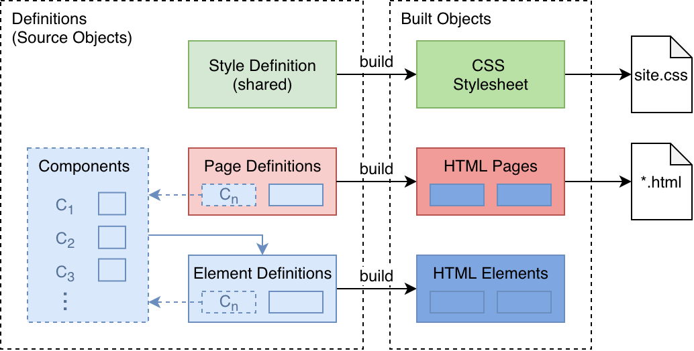

# Loom
## Overview
Loom is a desktop application designed to let anyone, from novices to developers, create static web sites. The tool is designed with the following goals:

* Easy to use
  * Even for users with no web experience
* Gives users the ability to control every detail of the page
  * Even without writing code
* Knowledge gained as a beginner user transfers to advanced use
  * Developers can jump into advanced use quickly
* Knowledge gained can transfer over to other tools
  * Even understanding / writing web code

## Design
The code for Loom is divided into two parts: Core and UI.

The Core package contains the “model” for Loom. This model includes source data (the objects that are directly modified by the user) and built data (objects that are “built” from the source objects and correspond directly to output data such as HTML and CSS), as well as the ability to read and write source data to files, and export built objects to files ready for serving over the web. The Core package also contains a basic CLI tool for building source files directly to output files.

The UI package contains the code for the graphical interface with which the user interacts. This package depends on the Core package, and essentially just provides a user-friendly interface for modifying source objects and performing actions such as exporting built objects to web files.

Ordinary users will not know that Loom is split into two parts, as they will just interact with the UI. However, in certain use cases such as cloud builds, the separation of the two packages is crucial.

Both packages are described in more detail below.

### Core
The Core package is responsible for the reading and writing of source data (also known as definitions) from Loom-specific source files, the transformation of these definitions into built objects, and the export of those built objects to web-compatible files which can be served to the web.

Definitions and Built Objects are closely related, as one of the goals of Loom is to make the model as “close” to true web technologies as possible; therefore the transformation between the two is not overly complex. However, certain “reasonable” abstractions are made, with ease of use in mind. These abstractions are intended to make developing a web site easier to manage using Loom.

#### Components
In general, every HTML Element belongs to one parent. That is, there is no concept of "reusable" Elements in pure HTML – if you want multiple identical elements, you have to repeat yourself. This quickly becomes a pain to manage, especially across many pages. Loom Core includes the ability to create reusable elements by the name of "Components". Components are essentially just named, reusable Elements.

Components exist only in the source data. A key-value map stores an association between each Component name and its corresponding element. Source Elements can include a reference to a Component by its name. When the source data gets built, the Component references get resolved and replaced with the corresponding Elements, so that the built data does not contain Component references; only HTML Elements.

#### Shared Styles
In general, every HTML Page can "link" to one or more CSS Stylesheets, whose styles will then be applied to that Page. However, this requires management of every page, ensuring that the correct Stylesheets are included for any elements on that page. In combination with components, it can become difficult to track which Stylesheets must be included on each page.

Loom simplifies this by using one shared Stylesheet across the entire project. This Stylesheet will be used by every page, and contains the styles for every Component. This greatly simplifies the management needed to ensure the correct styles get used on each page, but it also means the Stylesheet can become large and complex. The UI compensates for this by providing mechanisms to help the user easily find the style rules they are looking for.

#### Built Objects
Because of these abstractions, Definitions are not directly convertible to pure HTML / CSS, and so another step is required. This is where Built Objects come in.

Definitions can be "built" into objects which correspond directly to HTML / CSS. This process is straightforward, but not entirely trivial, and is made more complicated by the fact that Loom Core needs to support Loom UI by providing live changes in e.g. the WYSIWYG Editor.

To demonstrate the complication, suppose the user is using the WYSIWYG Editor in the UI to edit a page. The WYSIWYG Editor uses HTML and CSS, so it must use Built Objects to display the page content. Suppose now that the page contains a Component reference, and the user edits some data within that Component. The data inside the Component Definition should change, but the WYSIWYG Editor, which is using the Built Objects, should immediately reflect the change as well. In the future, Loom may support additional abstractions such as variables, which will only make this situation more complicated.

#### Events
To solve this issue, Loom Definitions and Built Objects make considerable use of event-driven programming. When a Built Object is created, it keeps track of its source Definition. Definitions emit events when their data changes, which Built Objects can listen for, and react to, in order to keep their data constantly up-to-date. Built Objects, in turn, emit events when their data changes, so that e.g. the WYSIWYG Editor can detect when the built data changes and immediately update the UI. In essence, the data / events flow from UI --> Definitions --> Built Objects --> UI.

### UI

The Loom UI is responsible for presenting the user with an easy-to-understand interface for working with the objects from Loom Core. This is a design challenge – the data should be presented in a way that feels intuitive and simple to use, but also give the user the power to change anything they need to. The UI should be inviting to developers – for example, the ability to edit raw HTML / CSS code, but not daunting to beginners.

**Disclaimer:** I am not a designer. The design I've come up with can certainly be improved in many ways.

The UI is separated into a few parts:

#### Navigator
The navigator appears on the left side of the UI and allows the user to choose the primary Definition they want to edit, such as a Page or Component, and an Element within. The navigator first displays a list of these, also allowing the user to create new Pages and Components if they wish.

Once the user selects a Page or Component, the Navigator switches to a view of the Elements within the selected object, in a navigable "tree" view. At the same time, the Editor appears in the center and right of the UI.

#### Editor
The Editor allows the user to edit the details of the selected Definition. The Editor may consist of multiple parts, such as both a WYSIWYG Editor in the center and a list of text input fields to the right.

**TODO:** Go into more detail

## Scope
For the scope of the Capstone project, the following goals and limitations will be placed on each package:

Core
* HTML: Pages, Elements, Reusable Components
* CSS: one Shared Stylesheet, basic Style Rules
* Save & Load Sources, Export Built Data

UI
* Navigate Pages, Components, Styles
* Basic WYSIWYG Editor for editing Pages, Components
* Input field-based editing of Element Attributes, Styles
  * Some "advanced" input types, such as dropdowns or color pickers

**Not doing:** Advanced CSS rules, JavaScript, Media / Asset files, Advanced UI Features

## Future Work

* Parameterized Components
  * Variables passed when using a Component
  * Can be used inside of component definition
  * Child Elements can also be passed
* Custom attributes (e.g. custom animation fields)
  * Can generate styles, scripts, etc.
  * Can be defined on an element / component
  * Processed into custom styles / Scripts
* Optimization; e.g. shortening class names
* Scripts, asset files
* Building individual pages
* Automatic linking of file locations
* Multiple Stylesheets